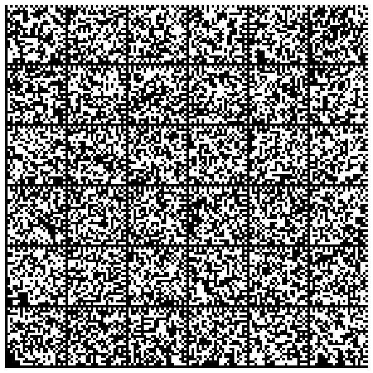
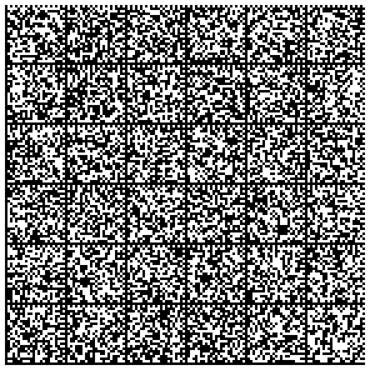
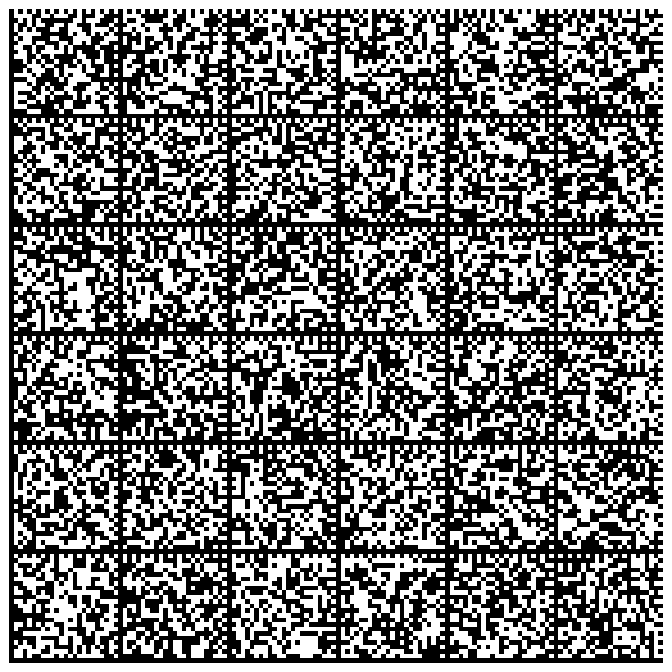
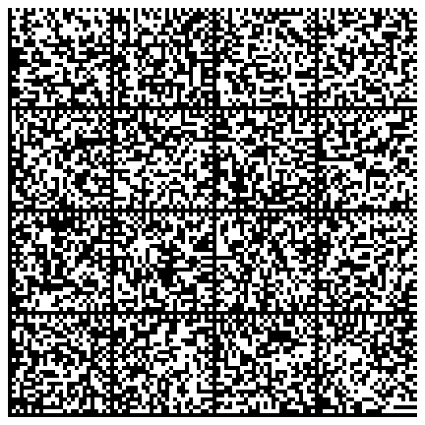

- [Introduction](#a0)
- [License](#a1)
- [Installation](#a2)
- [Synopsis](#a3)
- [Signing a document (using the private key)](#a4)
  * [Command line](#a5)
  * [API](#a6)
- [Clear signing a document (using the private key)](#a7)
  * [Command line](#a8)
  * [API](#a9)
- [Creating a detached signature (using the private key)](#a10)
  * [Command line](#a11)
  * [API](#a12)
- [Encrypting a document (using a public key)](#a13)
  * [Command line](#a14)
  * [API](#a15)
- [Decrypt a encrypted file](#a16)
  * [Command line](#a17)
  * [API](#a18)
- [Key management](#a19)
  * [API](#a20)
- [Other methods](#a21)
- [Testing the package](#a22)
  * [Importing these keys](#a23)
  * [Getting IDs and fingerprints](#a24)
- [Creating printed backups of private keys](#a25)
- [Regenerate keys from their graphical representations](#a26)
- [Useful links](#a27)


# <a name="a0"></a>Introduction

This package implements a wrapper around the PGP command line tool.

> Please note that the ambition of this wrapper is not to be "complete".
> This wrapper has been developed in order to automat the GPG processing of a large number of files.
> Therefore, only the basic GPG functionalities have been wrapped (signing, encryption, decryption and signature verification).

# <a name="a1"></a>License

This code is published under the following license:

[Creative Common Attribution-NonCommercial 4.0 International (CC BY-NC 4.0)](https://creativecommons.org/licenses/by-nc/4.0/legalcode)

See the file [LICENSE.TXT](LICENSE.TXT)

# <a name="a2"></a>Installation

From the command line:

    composer require dbeurive/gpg

Or, from within the file `composer.json`:

    "require": {
        "dbeurive/gpg": "*"
    }

# <a name="a3"></a>Synopsis

```php
// Get the fingerprint of a key.

$fgp = Gpg::getPublicKeyFingerPrint('protected key');
$fgp = Gpg::getPrivateKeyFingerPrint('protected key');

// Remove a key from the keyring.

Gpg::removePublicKey($fgp);
Gpg::removePrivateKey($fgp);

// Import a key into the keyring.

Gpg::importPublicKey('open.pub');
Gpg::importPrivateKey('open.prv');

// Check that a key is in the keyring.

Gpg::isPublicKeyPresent($fgp);
Gpg::isPrivateKeyPresent($fgp);

// Sign (encrypt with a private key).

Gpg::signFile('/path/to/document', $fgp, 'my password (if any), or null', '/path/to/encrypted_file');
Gpg::signFile('/path/to/document', $fgp, null, '/path/to/encrypted_file');
Gpg::signString('AZERTY', $fgp, 'my password (if any), or null', '/path/to/encrypted_file');
Gpg::signString('AZERTY', $fgp, null, '/path/to/encrypted_file');

$encryptedString = Gpg::signFile('/path/to/document', $fgp, 'my password (if any), or null', null);
$encryptedString = Gpg::signFile('/path/to/document', $fgp, null, null);
$encryptedString = Gpg::signString('AZERTY', $fgp, 'my password (if any), or null', null);
$encryptedString = Gpg::signString('AZERTY', $fgp, null, null);

// Clear sign

Gpg::clearSignFile('/path/to/document', $fgp, 'my password (if any), or null', '/path/to/signed_document');
Gpg::clearSignFile('/path/to/document', $fgp, null, '/path/to/signed_document');
Gpg::clearSignString('AZERTY', $fgp, 'my password (if any), or null', '/path/to/signed_document');
Gpg::clearSignString('AZERTY', $fgp, null, '/path/to/signed_document');

$signedDocument = Gpg::clearSignFile('/path/to/document', $fgp, 'my password (if any), or null', null);
$signedDocument = Gpg::clearSignFile('/path/to/document', $fgp, null, null);
$signedDocument = Gpg::clearSignString('AZERTY', $fgp, 'my password (if any), or null', null);
$signedDocument = Gpg::clearSignString('AZERTY', $fgp, null, null);

// Detach sign

Gpg::detachSignFile('/path/to/document', $fgp, 'my password (if any), or null', '/path/to/signature');
Gpg::detachSignFile('/path/to/document', $fgp, null, '/path/to/signature');
Gpg::detachSignString('AZERTY', $fgp, 'my password (if any), or null', '/path/to/signature');
Gpg::detachSignString('AZERTY', $fgp, null, '/path/to/signature');

$signature = Gpg::detachSignFile('/path/to/document', $fgp, 'my password (if any), or null', null);
$signature = Gpg::detachSignFile('/path/to/document', $fgp, null, null);
$signature = Gpg::detachSignString('AZERTY', $fgp, 'my password (if any), or null', null);
$signature = Gpg::detachSignString('AZERTY', $fgp, null, null);

// Verify a "clear" signature (that is: a file that contains the document and it signature)

$warning = null;
$status = Gpg::verifyClearSignedFile('/path/to/signed_document', $warning); // true: valid signature, false: invalid signature.
$status = Gpg::verifyClearSignedString($signature, $warning); // true: valid signature, false: invalid signature.

// Verify a "detached" signature (against a document)

$warning = null;
$status = Gpg::verifyDetachedSignedFile('/path/to/signature', '/path/to/document', $warning);
$status = Gpg::verifyDetachedSignedString($signature, '/path/to/document', $warning);

// Encrypt with a public key

Gpg::encryptAsymmetricFile('/path/to/document', $fgp, '/path/to/encrypted_file');
Gpg::encryptAsymmetricString('AZERTY', $fgp, '/path/to/encrypted_file');

$encryptedString = Gpg::encryptAsymmetricFile('AZERTY', $fgp, null);
$encryptedString = Gpg::encryptAsymmetricString('AZERTY', $fgp, null);

// Decrypt a document

Gpg::decryptFile('/path/to/encrypted_file', 'my password (if any), or null', '/path/to/decrypted_file');
Gpg::decryptFile('/path/to/encrypted_file', null, '/path/to/decrypted_file');
Gpg::decryptString($encryptedString, 'my password (if any), or null', '/path/to/decrypted_file');
Gpg::decryptString($encryptedString, null, '/path/to/decrypted_file');

$decryptedString = Gpg::decryptFile('/path/to/encrypted_file', 'my password (if any), or null', null);
$decryptedString = Gpg::decryptFile('/path/to/encrypted_file', null, null);
$decryptedString = Gpg::decryptString($encryptedString, 'my password (if any), or null', null);
$decryptedString = Gpg::decryptString($encryptedString, null, null);
```

For a detailed description of the return codes, please consult [this file](src/Gpg.php).

# <a name="a4"></a>Signing a document (using the private key)

To sign a document means: encrypt the document using the private key.

## <a name="a5"></a>Command line

Command:

    gpg --armor -u 03DEC874738344206A1A7D31E07D9D14954C8DC5 --output document.pgp --sign document

    # For automation inside a script:

    exec 3> /tmp/status; echo 'password' | gpg --batch --yes --always-trust --status-fd 3 --passphrase-fd 0 --armor -u 03DEC874738344206A1A7D31E07D9D14954C8DC5 --output document.pgp --sign document; echo $?; exec 3>&-

Then to decrypt the document (using the public key)

    gpg --output document.decrypted --decrypt document.pgp
    gpg --output - --decrypt document.pgp

> Please note that you can use the **sub key** associated to the private key instead of the private key itself.

## <a name="a6"></a>API

Sign:

    static function signFile($inAPath, $inPrivateKeyFingerPrint, $inOptPassword=null, $inOptSignaturePath=null)
    static function signString($inString, $inPrivateKeyFingerPrint, $inPassword=null, $inOptSignaturePath=null)

Decrypt:

    static function decryptFile($inAbsolutePath, $inOptPassword=null, $inOptOutputFile=null)
    static function decryptString($inString, $inOptPassword=null, $inOptOutputFile=null)

# <a name="a7"></a>Clear signing a document (using the private key)

To "clear sign" a document means:

* generate a hash of the document (using SHA1, for example).
* encrypt the previously generated hash with the private key.
* append the encrypted hash to the end of the document (which remains clear).

## <a name="a8"></a>Command line

Command:

    gpg --armor -u 03DEC874738344206A1A7D31E07D9D14954C8DC5 --output document.pgp --clearsign document

    # For automation inside a script:

    exec 3> /tmp/status; echo 'password' | gpg --batch --yes --always-trust --status-fd 3 --passphrase-fd 0 --armor -u 03DEC874738344206A1A7D31E07D9D14954C8DC5 --output document.pgp --clearsign document; echo $?; exec 3>&-

Verify the signature:

    gpg --verify document.pgp

## <a name="a9"></a>API

Sign:

    static function clearSignFile($inPath, $inPrivateKeyFingerPrint, $inOptPassword=null, $inOptSignaturePath=null)
    static function clearSignString($inString, $inPrivateKeyFingerPrint, $inPassword=null, $inOptSignaturePath=null)

Verify the signature:

    static function verifyClearSignedFile($inFilePath, &$outWarning)
    static function verifyClearSignedString($inString, &$outWarning) {

# <a name="a10"></a>Creating a detached signature (using the private key)

Creating a "detached signature" means:

* generate a hash of the document (using SHA1, for example).
* encrypt the previously generated hash with the private key.
* write the encrypted hash in a (specified) file.

Please note that a "detached signature" and a "clear signature" are identical.
The difference between a "detached signature" and a "clear signature" is that the former is put into a separate file, whereas the latter is appended to the end of the signed document.

## <a name="a11"></a>Command line

Command:

    gpg --armor -u 03DEC874738344206A1A7D31E07D9D14954C8DC5 --output document.PGP --detach-sign document

    # For automation inside a script:

    exec 3> /tmp/status; echo 'password' | gpg --batch --yes --always-trust --status-fd 3 --passphrase-fd 0 --armor -u 03DEC874738344206A1A7D31E07D9D14954C8DC5 --output document.pgp --detach-sign document; echo $?; exec 3>&-

Verify the signature:

    gpg --verify document.pgp document

## <a name="a12"></a>API

Sign:

    static function detachSignFile($inPath, $inPrivateKeyFingerPrint, $inOptPassword=null, $inOptSignaturePath=null)
    static function detachSignString($inString, $inPrivateKeyFingerPrint, $inPassword=null, $inOptSignaturePath=null)

Verify a signature:

    static function verifyDetachedSignedFile($inSignatureFilePath, $inDocument, &$outWarning)
    static function verifyDetachedSignedString($inSignature, $inDocument, &$outWarning)

# <a name="a13"></a>Encrypting a document (using a public key)

Please note that in GPG lingo, encryption using a private key is called "signing" (which, technically speaking, is an encryption).

## <a name="a14"></a>Command line

Command:

    gpg --armor --output encrypted_file --encrypt --recipient 03DEC874738344206A1A7D31E07D9D14954C8DC5 document

    # For automation inside a script:

    exec 3> /tmp/status; gpg --batch --yes --status-fd 3 --always-trust --armor --output document.pgp --encrypt --recipient 03DEC874738344206A1A7D31E07D9D14954C8DC5 document; echo $?; exec 3>&-

Decrypt the file (using a private key):

    gpg --output document --decrypt document.pgp

## <a name="a15"></a>API

    static function encryptAsymmetricFile($inInputPath, $inPublicKeyFingerPrint, $inOptOutputFile=null)
    static function encryptAsymmetricString($inString, $inPublicKeyFingerPrint, $inOptOutputFile=null)

# <a name="a16"></a>Decrypt a encrypted file

Please note that the document may have been encrypted using a public key or a secret key (that is, _signed_).

* If the document has been encrypted with a public key (probably yours), you will need a private key to decrypt it.
* If the document has been signed with a private key, you will need a public key to decrypt it.

## <a name="a17"></a>Command line

Command:

    gpg --output document --decrypt document.pgp

For automation inside a script:

    exec 3> /tmp/status; echo 'password' | gpg --batch --yes --status-fd 3 --passphrase-fd 0 --always-trust --output document --decrypt document.pgp; echo $?; exec 3>&-

## <a name="a18"></a>API

    static function decryptFile($inAbsolutePath, $inOptPassword=null, $inOptOutputFile=null)
    static function decryptString($inString, $inOptPassword=null, $inOptOutputFile=null)

# <a name="a19"></a>Key management

Except when calling the methods that returns the fingerprints (`getPublicKeyFingerPrint` and `getPrivateKeyFingerPrint`), the keys are identified by their fingerprints
This ensures maximum security against "side effects" that may occur when specifying keys' IDs.

## <a name="a20"></a>API

    static function getPublicKeyFingerPrint($inPublicKey)
    static function getPrivateKeyFingerPrint($inPrivateKey)
    static function isPrivateKeyPresent($inPrivateKeyFingerPrint)
    static function isPublicKeyPresent($inPublicKeyFingerPrint)
    static function removePrivateKey($inPrivateKeyFingerPrint)
    static function removePublicKey($inPublicKeyFingerPrint)
    static function importPrivateKey($inPrivateKeyPath)
    static function importPublicKey($inPublicKeyPath)

# <a name="a21"></a>Other methods

    static function version()
    static function checkVersion()

# <a name="a22"></a>Testing the package

This package contains two pairs of keys:

* One pair which secret key is protected by a password.
* One pair which secret key is not protected.

These keys are located in the directory `tests/data`:

* `open.prv` / `open.pub`: this pair of keys is not protected.
* `protected.prv` / `protected.pub`: this pair of keys is protected.

## <a name="a23"></a>Importing these keys

    cd tests/data
    gpg --import open.prv; gpg --import open.pub; gpg --import protected.prv; gpg --import protected.pub

## <a name="a24"></a>Getting IDs and fingerprints

For public keys:

    gpg --batch --list-keys --fingerprint --with-colon

For private keys:

    gpg --batch --list-secret-keys --fingerprint --with-colon

> See [this document](http://git.gnupg.org/cgi-bin/gitweb.cgi?p=gnupg.git;a=blob_plain;f=doc/DETAILS) for a detailed description of the output of the option `--with-colon`.

The Perl script [list-keys.pl](utilities/list-keys.pl) may be used to print the list of public keys.

    gpg --list-keys --with-colon --fingerprint | perl list-keys.pl
    gpg --list-secret-keys --with-colon --fingerprint | perl list-keys.pl

Example:

`   gpg --list-secret-keys --with-colon --fingerprint | perl list-keys.pl`

Outputs:

    6   sec E07D9D14954C8DC5 03DEC874738344206A1A7D31E07D9D14954C8DC5 0C185D728E760EC0 open key <ok@test.com>
    6   sec 29A778386005B911 881C41F8B8FD138E86E7230929A778386005B911 6A492A01B27F4819 protected key <pk@test.com>

Whith:

    Column 1: the total number of columns for the current line.
    Column 2: the type of key (pub: public, sec: secret).
    Column 3: the UID of the key.
    Column 4: the fingerprint of the key.
    Column 5: the UID of the associated sub key.
    Column 6: the ID of the key.

Please note that

* the last field of each line may have spaces (ex: `PHP coder <php_coder@php.com>`).
* a key may have more than one sub key. Therefore, a line may have more than 6 columns.

# <a name="a25"></a>Creating printed backups of private keys

You can produce graphical representations of your private keys.
These representations can be printed on paper.

> Please note that you should not need to produce graphical representations of your public keys.
> Indeed, public keys do not need to be protected. Therefore you can make copies of your public keys everywhere.

Install Data Matrix tools:

```sh
    $ sudo apt-get install  dmtx-utils
```

Generate a very long RSA keys:

```sh
    $ cat -n batch.txt
         1	%echo Generating a basic OpenPGP key
         2	Key-Type: RSA
         3	Key-Length: 8192
         4	Subkey-Type: RSA
         5	Subkey-Length: 8192
         6	Name-Real: Tester Long
         7	Name-Comment: This is for testing
         8	Name-Email: joe-long@foo.bar
         9	Expire-Date: 0
        10	Passphrase: abc
        11	# Do a commit here, so that we can later print "done" :-)
        12	%commit
        13	%echo done

    $ cat batch.txt | gpg --enable-large-rsa --batch --gen-key
```

Find the ID or the fingerprint of the generated keys:

By ID:

 ```sh
    $ gpg --list-keys
    sec   8192R/9BEF3AAC 2016-12-30
    uid                  Tester Long (This is for testing) <joe-long@foo.bar>
    ssb   8192R/3A57FB1C 2016-12-30

    $ gpg --export 9BEF3AAC > very-long-key.pub

    $ gpg --export-secret-key 9BEF3AAC > very-long-key.prv
```

By fingerprint:

```sh
    $ gpg --list-keys --fingerprint --with-colons
    pub:-:8192:1:FB9F45539BEF3AAC:2016-12-30:::-:Tester Long (This is for testing) <joe-long@foo.bar>::escaESCA:
    fpr:::::::::1335EF5C02BEF36A56DBA451FB9F45539BEF3AAC:
    sub:-:8192:1:1D4050C33A57FB1C:2016-12-30::::::esa:
```

Then generate images that represent the private key:

```sh
    $ gpg --export-secret-key 9BEF3AAC | paperkey --output-type raw | split -b 1500 - key-

    # Or:
    # gpg --export-secret-key 1335EF5C02BEF36A56DBA451FB9F45539BEF3AAC | paperkey --output-type raw | split -b 1500 - key-

    $ cat -n gen-images.sh
         1	#!/bin/bash
         2
         3	for K in key-*; do
         4	    dmtxwrite -e 8 $K > $K.png
         5	done

    $ ./gen-images.sh

    $ ls -1 *.png
    key-aa.png
    key-ab.png
    key-ac.png
    key-ad.png
```

The list of images that represents the private key is:









# <a name="a26"></a>Regenerate keys from their graphical representations

```sh
    $ cat -n gen-key.sh
         1	#!/bin/bash
         2
         3	rm -f key.prv
         4	for K in key-*.png; do
         5	    echo $K
         6	    dmtxread $K >> key.prv
         7	done

    $ ./gen-key.sh

    $ paperkey --pubring ~/.gnupg/pubring.gpg --secrets key.prv > restore.raw

    # Or:
    # paperkey --pubring very-long-key.pub --secrets key.prv > restore.raw
```

> Please note that you need the public key in order to regenerate the private key!
> The public key can be stored within the public keyring, or within a file.

Compare the restored key against the original:

```sh
    $ gpg --list-packets restore.raw > f1

    $ gpg --list-packets very-long-key.prv > f2

    $ diff f1 f2
```

If you try to import the restored private key:

```sh
    $ gpg --import restore.raw
    gpg: key 9BEF3AAC: already in secret keyring
    gpg: Total number processed: 1
    gpg:       secret keys read: 1
    gpg:  secret keys unchanged: 1
```

Sign a document with the original private key:

```sh
    $ gpg -u 9BEF3AAC --sign gen-key.sh
```

Remove the original private key from its keyring:

```sh
    $ gpg --delete-secret-keys 9BEF3AAC
```

Restore the secret key using the backup:

```sh
    $ gpg --import restore.raw
    gpg: key 9BEF3AAC: secret key imported
    gpg: key 9BEF3AAC: "Tester Long (This is for testing) <joe-long@foo.bar>" not changed
    gpg: Total number processed: 1
    gpg:              unchanged: 1
    gpg:       secret keys read: 1
    gpg:   secret keys imported: 1
```

Then, make sure that the restored secret key works as expected:

```
    $ gpg --output script.sh --decrypt gen-key.sh.gpg

    $ diff gen-key.sh script.sh
```

# <a name="a27"></a>Useful links

https://www.void.gr/kargig/blog/2013/12/02/creating-a-new-gpg-key-with-subkeys/

http://www.spywarewarrior.com/uiuc/gpg/gpg-com-4.htm

